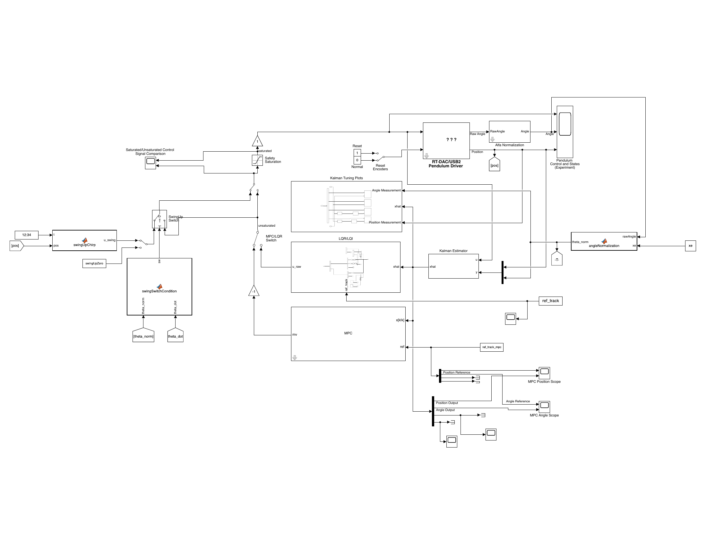

# Modelling, Identification, Estimation and Control of an INTECO Pendulum on a Cart

A complete control pipeline of the INTECO pendulum on a cart (https://www.inteco.com.pl/products/pendulum-cart-control-system/), covering dynamical
modelling by the Lagrangian method, nonlinear grey box parameter identification, state estimation
with a Kalman filter, and the design of LQR, LQI and MPC controllers for the regulation,
reference tracking and swing up problems. The implementation is in MATLAB and Simulink.



---

## Problem statement

The INTECO pendulum on a cart rig consists of a cart on a 1.8 m rail, actuated by a PWM driven DC
motor, carrying a pivoted rod that is free to rotate a full revolution. Only the cart position and the pendulum angle are measured, by incremental encoders.

Three objectives are considered, namely (i) regulation of the pendulum about its unstable upright
equilibrium, (ii) tracking of a cart position reference while the pendulum is held upright, and
(iii) swing up from the downward equilibrium.

The actuation is indirect, since the motor acts on the cart and the pendulum responds only through the pivot reaction, so every cart displacement requires a bounded transient deflection that must be removed before arrival. The rig is also subject to Coulomb and viscous rail friction, viscous pivot friction, a constant bias force from rail inclination and cable drag, and motor back EMF damping; these effects are retained in the model, and the two unmeasured velocity states are reconstructed by the estimator.

**Physical parameters** (nominal values, used as initial estimates for identification).

| Symbol | Meaning | Value |
|---|---|---|
| $m$ | equivalent translating mass (cart and pendulum) | 0.872 kg |
| $\ell$ | pivot to pendulum centre of mass | 0.011 m |
| $J_p$ | pendulum inertia about the pivot | 2.92 × 10⁻³ kg·m² |
| $f_c$ | cart viscous friction | 0.5 N·s/m |
| $f_s$ | Coulomb (static) friction | 1.203 N |
| $f_p$ | pivot viscous friction | 6.65 × 10⁻⁵ N·m·s/rad |
| $p_1$ | PWM command to force gain | 9.4 N |
| $p_2$ | back EMF damping | −0.548 N·s/m |
| $g$ | gravitational acceleration | 9.81 m/s² |
| $R_l$ | rail length | 1.8 m |
| $u_{\max}$ | PWM command magnitude limit | 0.5 |

**Model and simulation settings.**

| Setting | Value |
|---|---|
| Sample period $T_s$ | 0.01 s |
| Sample rate | 100 Hz |
| Discretisation | zero order hold (`c2d`) |
| Friction smoothing constant $\alpha$ | 10 |
| Control design equilibrium | upright, $x_e = [0,\ \pi,\ 0,\ 0]^\top$ |

---

## Dynamical model

### Generalised coordinates and states

The generalised coordinates are the cart displacement $x$ and the pendulum angle $\theta$. The state and measurement vectors are

$$
x = [x_1,\ x_2,\ x_3,\ x_4]^\top = [x,\ \theta,\ \dot{x},\ \dot{\theta}]^\top,
\qquad
y = \begin{bmatrix} 1 & 0 & 0 & 0 \\ 0 & 1 & 0 & 0 \end{bmatrix} x .
$$

### Nonlinear state space representation

The cart force reduces to a static PWM to force map with a back EMF damping term once the fast
armature dynamics are neglected. Applying the Euler Lagrange equations with viscous and Coulomb
rail friction, viscous pivot friction and a constant bias force, then solving for the
accelerations, gives the nonlinear model in `SysID/invPend_model.m`,

$$
\ddot{x} = \frac{a_1\!\left(k_1 u - \dot\theta^2\sin\theta - k_2\dot{x} - k_s\tanh(\alpha\dot{x}) + k_d\right) - \left(g\sin\theta + k_3\dot\theta\right)\cos\theta}{a_1 a_2 - \cos^2\theta},
$$

$$
\ddot{\theta} = \frac{\left(k_1 u - \dot\theta^2\sin\theta - k_2\dot{x} - k_s\tanh(\alpha\dot{x}) + k_d\right)\cos\theta - a_2\!\left(g\sin\theta + k_3\dot\theta\right)}{a_1 a_2 - \cos^2\theta}.
$$

The identified parameters form the structured vector

$$
\theta_p = [a_1,\ a_2,\ k_1,\ k_2,\ k_3,\ k_s,\ k_d]^\top,
$$

$$
a_1 = \frac{J_p}{m\ell},\quad
a_2 = \frac{1}{\ell},\quad
k_1 = -\frac{p_1}{m\ell},\quad
k_2 = \frac{f_c - p_2}{m\ell},\quad
k_3 = \frac{f_p}{m\ell},\quad
k_s = \frac{f_s}{m\ell},\quad
k_d = \frac{F_d}{m\ell}.
$$

### Linearisation

The model is linearised about an equilibrium $(x_e, u_e)$ with $u_e = -k_d/k_1$, then discretised
at 100 Hz with a ZOH. The downward equilibrium $x_e = [0,0,0,0]^\top$ is used for estimator tuning and the upward equilibrium $x_e = [0,\pi,0,0]^\top$ for controller design. The upward model is

$$
A_{\mathrm{up}} \approx
\begin{bmatrix}
0 & 0 & 1 & 0\\
0 & 0 & 0 & 1\\
0 & -0.2444 & -11.3455 & -0.0002\\
0 & -27.7735 & -31.3399 & -0.0266
\end{bmatrix},
\qquad
B_{\mathrm{up}} \approx
\begin{bmatrix} 0 \\ 0 \\ -18.0449 \\ -49.8458 \end{bmatrix}.
$$

Both discretised pairs are controllable and observable. In every result below the linear
controllers act on the full nonlinear plant, so the model mismatch is part of what the closed loop rejects.

---

## System identification

A nonlinear grey box approach is used, keeping the equations of motion and estimating only the entries of $\theta_p$ from data recorded about the downward equilibrium. The three stages below each seed the next, and every record is split 75 % for estimation and 25 % for validation.

### Pendulum dynamics (Stage 1)

With the cart clamped, the pendulum oscillates freely from an initial angle of about 20 to 30°,
leaving only $a_1$ and $k_3$ identifiable.

<p align="center">
  
  
</p>

Estimation fit (99.58 %) and validation fit (99.48 %).

### Cart dynamics (Stage 2)

With the pendulum centre of mass moved onto the pivot, the cart is driven rail to rail by a PWM
sequence with unactuated intervals that expose the friction, identifying $k_1$, $k_2$, $k_s$ and
$k_d$.

<p align="center">
  
  
</p>

Estimation fit (94.24 %) and validation fit (95.64 %).

### Coupled cart and pendulum dynamics (Stage 3)

With both bodies free, all seven parameters are estimated jointly under the full coupled model,
with $a_2 = 1/\ell$ fixed and the rest bounded to ±25 % of their stage 1 and stage 2 values.

<p align="center">
  
  
</p>

Estimation fit (93.9 % cart, 77.6 % pendulum) and validation fit (96.8 % and 83.3 %).

### Identified parameters

The stage 3 vector, used throughout the repository (`main.m`).

| $a_1$ | $a_2$ | $k_1$ | $k_2$ | $k_3$ | $k_s$ | $k_d$ |
|---|---|---|---|---|---|---|
| 0.362015 | 113.636338 | −2000.714368 | 238.679879 | 0.009382 | 101.924343 | 15.346870 |

---

## State estimation

Only $x$ and $\theta$ are measured, so a discrete time Kalman filter on the downward linearised
model reconstructs the two velocities. The angle is unwrapped by `angleNormalization` and the
filter runs in equilibrium relative coordinates. The covariances, tuned in open loop, are

$$
Q = \mathrm{diag}(10^{-4},\ 10^{-2},\ 1.5\times10^{2},\ 1.5\times10^{2}),
\qquad
R = \mathrm{diag}(10^{-6},\ 10^{-6}).
$$

The small $R$ trusts the encoders; the large process noise on the velocities lets the filter lean
less on the model where nothing is measured.

<p align="center">
  
  
</p>
<p align="center">
  
  
</p>

The cart position (top left) and pendulum angle (top right) are reconstructed almost exactly, as
they are measured. The cart velocity (bottom left) and angular velocity (bottom right) are
inferred, and track the filtered finite difference references closely with small lag and noise.

---

## Controller design

### LQR/LQI

A state feedback gain from `dlqr` on the upward model. LQR covers objective 1, and its integral
extension LQI covers objective 2. The weights are

| | $x$ | $\theta$ | $\dot{x}$ | $\dot{\theta}$ | $\xi$ (integral) | $R$ |
|---|---|---|---|---|---|---|
| LQR $Q$ | 80 | 100 | 75 | 100 | n/a | 50 |
| LQI $Q$ | 75 | 100 | 75 | 100 | 250 | 75 |

The command is $u = u_e - K\hat{x}$ with an output saturation. LQI augments the plant with the
integral of the cart position error and feeds the differentiated position reference into the
velocity error term, avoiding a second integrator that would make the augmented pair
uncontrollable.

### MPC

Output feedback MPC with the Kalman filter as its estimator, prediction horizon $N = 40$ (0.4 s), control horizon 10, terminal weight from the Riccati equation, and nominal input $u_e$. The constraints below are enforced in the quadratic program.

| | $x$ | $\theta$ | $\dot{x}$ | $\dot{\theta}$ | $\Delta u$ |
|---|---|---|---|---|---|
| weight | 95 | 100 | 30 | 10 | 12.5 |

| constraint | $u$ | $x$ (regulation) | $x$ (tracking) | $\theta$ |
|---|---|---|---|---|
| bound | ±0.75 | ±0.02 m | ±0.8 m | ±0.2 rad |

The ±0.8 m bound keeps a margin to the ±0.9 m rail ends and the ±0.2 rad bound keeps the linear
prediction valid. Output constraints are soft, so a large transient relaxes them instead of making the program infeasible.

---

## Results

Each pair shows cart position (left) and pendulum angle (right), upright at zero. All runs use the nonlinear plant with the Kalman filter in the loop, and several include manual disturbances to the pendulum.

### Regulation (Objective 1)

LQR holds the angle within about ±0.01 rad (±0.57°) and the cart within about ±5 cm and rejects
disturbances, but without integral action the cart does not return to its original position.

<p align="center">
  
  
</p>

MPC reaches comparable bands (±0.01 rad, ±2 cm) with the position constraint active and a smoother angle between disturbances.

<p align="center">
  
  
</p>

### Reference tracking (Objective 2)

Both controllers track a 0.70 m, 0.065 Hz sinusoidal cart position reference while regulating the
pendulum.

LQI tracks accurately after an initial transient from the mismatched velocity reference, holding
the angle near ±0.01 rad with larger excursions at the disturbances.

<p align="center">
  
  
</p>

MPC tracks about as well, with slightly more error near the reference extrema from trading
tracking against effort and the angle constraint, and a smoother angle.

<p align="center">
  
  
</p>

### Swing up (Objective 3)

A chirp excitation swings the pendulum up from the downward equilibrium. The angle record
alternates between ±π because the upward model wraps it. Capture occurs at about 6 s, when the
stabilising controller takes over.

**LQR stabiliser**

<p align="center">
  
  
</p>

**MPC stabiliser**

<p align="center">
  
  
</p>

---

## Comparison of LQI and MPC

| Aspect | LQI | MPC |
|---|---|---|
| Sinusoidal position tracking | accurate, faster transient, larger overshoot | accurate, smoother, small lag near the extrema |
| Angle regulation during tracking | within ±0.01 rad, larger oscillation | within ±0.01 rad, smaller oscillation |
| Constraint handling | external saturation and switching logic | rail, PWM and angle bounds in the optimisation |
| Swing up capture time | ~6 s | ~6 s |
| Cart motion after the swing up handover | larger excursions, up to ~0.29 m | more bounded, ~0.1 m |
| Disturbance rejection | faster, larger overshoot | slower, more conservative |

**Reference tracking**, both controllers overlaid, with cart position on the left and pendulum
angle on the right.

<p align="center">
  
  
</p>

**Swing up**, both controllers overlaid.

<p align="center">
  
  
</p>

LQI is preferable for simplicity and fast tracking. MPC is preferable when the rail, PWM and angle limits must all hold at once, since it plans within them rather than clipping the command
afterwards.

---

## Repository layout

| Path | Purpose |
|---|---|
| `main.m` | Loads the identified parameters, builds the linearised models, computes the LQR and LQI gains, constructs the MPC, and generates the reference and swing up signals. Executed before the Simulink model. |
| `pendulum_cart.slx` | Simulink model for the rig, containing the RT-DAC/USB2 driver, angle normalisation, Kalman estimator, LQR and LQI subsystem, MPC block, swing up chirp and switching logic, safety saturation, and scopes. |
| `SysID/fixed_cart_id.m`, `fixed_cart_model.m` | Stage 1, pendulum dynamics with the fixed cart ($a_1$, $k_3$). |
| `SysID/fixed_pendulum_id.m`, `fixed_pendulum_model.m` | Stage 2, cart dynamics with the fixed pendulum ($k_1$, $k_2$, $k_s$, $k_d$). |
| `SysID/invPend_id.m`, `invPend_model.m` | Stage 3, coupled nonlinear grey box estimation. |
| `dataExtraction.m` | Converts a Simulink scope log into the `expData` structure used for identification. |
| `generatePWM.m` | Rail to rail PWM excitation with unactuated intervals, used in the identification experiments. |
| `comparisonPlotRefTracking.m` | LQI and MPC reference tracking figures from the stored logs. |
| `comparisonPlotSwingUp.m` | LQI and MPC swing up figures from the stored logs. |
| `Dataset/` | Identification records and controller comparison logs (`.mat`). |
| `Plots/` | Figures, organised by category. `pendulum_cart.pdf` and `pendulum_cart.png` contain the block diagram. |

---

## Software requirements

- MATLAB R2020a or later, with Simulink
- Control System Toolbox (`c2d`, `ss`, `dlqr`, `dare`, `ctrb`, `obsv`, `kalman`)
- System Identification Toolbox (`idnlgrey`, `nlgreyest`, `compare`), for the `SysID/` scripts
- Model Predictive Control Toolbox (`mpc`, `mpcstate`, `setEstimator`)
- Signal Processing Toolbox (`smoothdata` with the `sgolay` method), for the identification scripts
- INTECO **RT-DAC/USB2** real time toolbox and the physical rig

The identification scripts, the comparison scripts and all figures in `Plots/` can be run without
hardware. See [`requirements.txt`](requirements.txt) for the same list in a checkable form.

---

## Usage

Construct the model, gains and MPC object, then open and run the Simulink model.

```matlab
main
open_system('pendulum_cart')     % requires the rig and the real time toolbox
```

Reproduce the identification from the recorded data sets.

```matlab
cd SysID
fixed_cart_id       % stage 1, pendulum
fixed_pendulum_id   % stage 2, cart
invPend_id          % stage 3, coupled
```

Regenerate the comparison figures from the stored logs.

```matlab
comparisonPlotRefTracking
comparisonPlotSwingUp
```

---

## Authors

Kadir Aksu, Erdem Yozdemir

## License

Released under the MIT License. See [`LICENSE`](LICENSE) for the full text.
